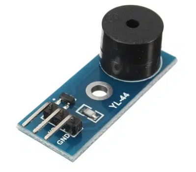
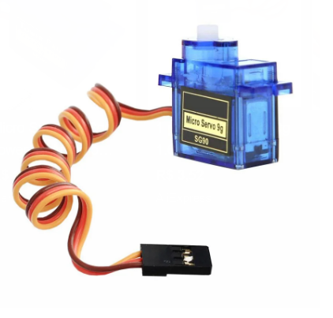
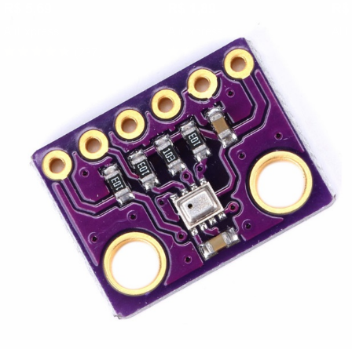
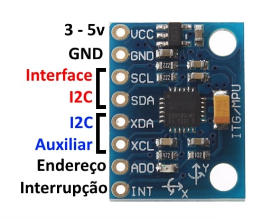

Componentes
###########

.. contents::
   :local:
   :depth: 2

Buzzer
******

Componente escolhido: Módulo Buzzer Ativo YL-44

Alimentação: 3,3 ~ 5V

Controle: High / Low

Destacando que a diferença de um buzzer passivo para um ativo é que, com
um buzzer passivo, conseguimos fazê-lo emitir diferentes tons variando a
frequência. Já com o buzzer ativo, conseguimos apenas fazê-lo apitar ou não
apitar.

Como, para o projeto em questão, a função do buzzer será apenas identificar
a localidade do foguete após a queda, o buzzer ativo é suficiente para essa
função.

Pinos:

* VCC → alimentação
* GND → terra
* S → sinal digital

Servomotor
***********

Componente escolhido: SG90

Micro servomotor que controla a posição angular de 0° a 180°.

A função do servomotor será abrir o paraquedas após o apogeu.

Alimentação: 5V

Controle: PWM

Pinos:

* VCC (vermelho) → alimentação
* GND (marrom) → terra
* Signal (laranja) → sinal PWM

Observação: o controle é feito por largura de pulso (PWM), em que diferentes
pulsos correspondem a diferentes ângulos.

Barômetro
*********

Componente escolhido: BMP280

Sensor de pressão e temperatura.

Terá como função calcular a altitude com base na variação da pressão
atmosférica.

Alimentação: 3,3V

Controle: I2C

Funcionamento físico
====================

O BMP280 utiliza um sensor piezoresistivo. A pressão do ar deforma uma
membrana microscópica interna, alterando sua resistência elétrica. Essa
variação é convertida em sinal digital. Como a pressão atmosférica diminui
com o aumento da altitude, é possível calcular a altura do foguete.

Pinos:

* VCC → alimentação
* GND → terra
* SCL → clock I2C
* SDA → dados I2C

Bibliotecas
===========

`ebrazedev <https://github.com/ebrezadev/BMP280-Barometric-Pressure-and-Temperature-Sensor-C-Driver/blob/main/example/linux/main.c>`_

* Escrita em C puro e portável.
* Compatível com ESP32 (ESP-IDF).
* Suporte a I2C e SPI.
* Estrutura baseada em handle, responsável pelo estado do sensor.
* Inclui cálculo de altitude.
* Possui tratamento de erros.

`Yenya <https://github.com/Yenya/avr-bmp280>`_

* Leitura de pressão e temperatura.
* Cálculo de altitude.
* Cálculo de taxa de subida (climb rate).
* Armazenamento de altitude máxima.
* Será necessário adaptar o I2C.
* Será necessário adaptar o delay.

Acelerômetro
************

Componente escolhido: MPU6050

Sensor que combina acelerômetro e giroscópio (6 eixos).

Será utilizado para detectar movimento, aceleração e possível identificação
do apogeu do foguete.

Alimentação: 3,3V

Controle: I2C

Funcionamento físico
====================

O acelerômetro funciona com base em estruturas microscópicas (MEMS) que se
deslocam quando submetidas à aceleração. Esse deslocamento altera
propriedades elétricas, como a capacitância, permitindo medir aceleração nos
eixos X, Y e Z.

Pinos:

* VCC → alimentação
* GND → terra
* SCL → clock I2C
* SDA → dados I2C
* INT → interrupção (opcional)

Bibliotecas
===========

`JRowberg MPU6050 (ESP-IDF) <https://github.com/jrowberg/i2cdevlib/tree/master/ESP32_ESP-IDF/components/MPU6050>`_

* Comunicação via I2C utilizando I2Cdev.
* Leitura de acelerômetro e giroscópio (6 eixos).
* Funções prontas para leitura de dados brutos e convertidos.
