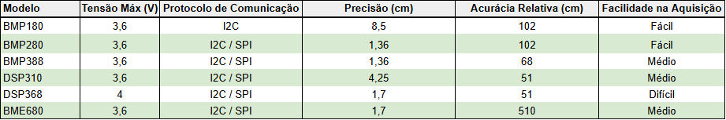
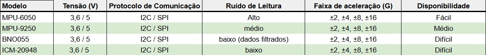
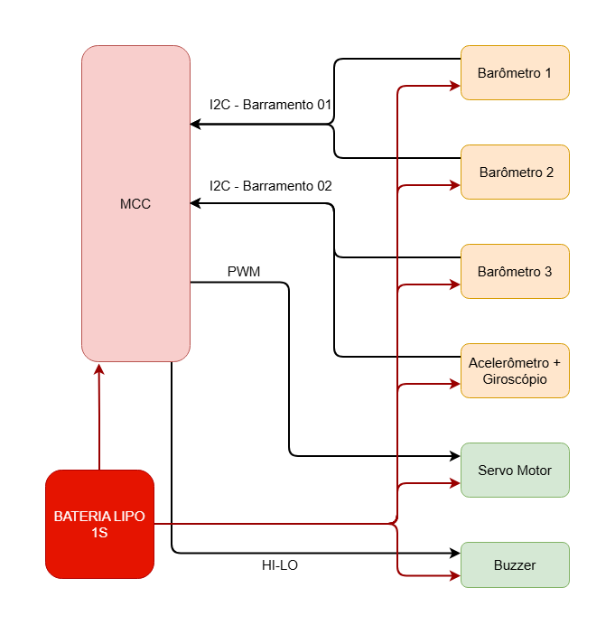

Etapa 1
#######

.. contents::
   :local:
   :depth: 2

Visão geral
***********

A Etapa 1 tem como objetivo estruturar os requisitos do projeto, de modo a definir a escolha dos componentes que atendam às necessidades do projeto.

A partir dessa definição, são realizadas a seleção e aquisição dos componentes, bem como a pesquisa das bibliotecas necessárias para o desenvolvimento. Além disso, esta etapa contempla o estudo dos sensores envolvidos e a elaboração de um diagrama de blocos simples, servindo como base para as próximas fases do projeto.

Desenvolvimento
***************

O dispositivo sendo desenvolvido deve ser capaz de medir com confiança e precisão altitude do foguete, ser capaz de abrir um sistema de paraquedas e emitir um sinal sonoro para facilitar sua localização no solo após aterrisagem. Para garantir os requisitos de altitude, serão integrados múltiplos módulos com barômetros, o qual passará por um filtro digital de modo que a medida seja a mais correta possível. Será implementado um atuador mecânico, neste caso um servo motor, para abertura do paraquedas quando for detectado o momento certo. Os dados de um acelerômetro serão cruzados com o barômetro para detectar apogeu. Após a aterrisagem do foguete, um buzzer será acionado de forma intermitente que facilitará encontrar o foguete. Para alimentar todos os sitemas, uma bateria leve será embarcada.

Para auxiliar na seleção dos componentes de cada requisito, foi realizado uma pesquisa de alguns sensores e criado uma tabela para cada um que agrega os critérios de seleção mais importantes:

Para a seleção dos barômetros foram selecionados 6 modelos disponíveis no mercado nacional e internacional. Dado o prazo de implementação e a disponibilidade no mercado nacional, disponibilidade de bibliotecas e acurácia boa para esta aplicação, foi selecionado o sensor BMP280 para o projeto. Para a implementação do giroscópio analisamos 4 modelos conforme podemos na tabela abaixo:

Podemos perceber que todos os modelos de acelerômetro possuem faixas de medição de aceleração, tensão de operação e protocolo de comunicação iguais. Com isso em mente parâmetros que definem a escolha do sensor passam a ser disponibilidade no mercado, SNR, disponibilidade de bibliotecas e custo. O modelo MPU6050 foi selecionado por ter um custo menor que os outros, muitas bibliotecas disponíveis e ser de fácil aquisição no mercado nacional, entretanto muito cuidado deve ser tomado com seus dados pois são sucetíveis a ruído, desse modo ficando evidente a necessidade de implementação de algum método de filtragem.

Testes
======

Descrição dos testes/validações realizadas.

Componentes
======
`Ver componentes <etapa_1/Componentes.md>`_

Diagrama de blocos
================================

Referências (links/datasheets/livros)
*************************************

- `nRF Connect SDK <https://developer.nordicsemi.com/nRF_Connect_SDK/doc/2.4.2/nrf/getting_started/modifying.html#configure-application>`_
- `BMP180 Datasheet <https://cdn-shop.adafruit.com/datasheets/BST-BMP180-DS000-09.pdf>`_
- `BMP280 Datasheet <https://www.bosch-sensortec.com/media/boschsensortec/downloads/datasheets/bst-bmp280-ds001.pdf>`_
- `BMP388 Datasheet <https://www.bosch-sensortec.com/media/boschsensortec/downloads/datasheets/bst-bmp388-ds001.pdf>`_
- `DPS310 Datasheet <https://br.mouser.com/pdfdocs/Infineon-DPS310-DS-v01_00-EN2.pdf>`_
- `DPS368 Datasheet <https://www.infineon.com/assets/row/public/documents/24/49/infineon-dps368-datasheet-en.pdf>`_
- `Adafruit BMP280 Sensor Overview <https://cdn-learn.adafruit.com/downloads/pdf/adafruit-bmp280-barometric-pressure-plus-temperature-sensor-breakout.pdf>`_
