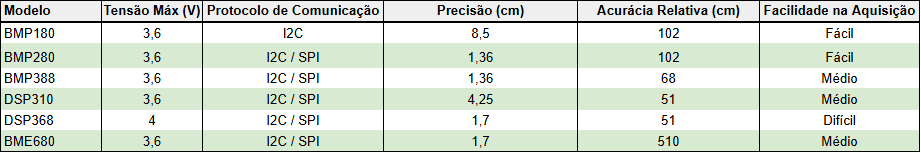
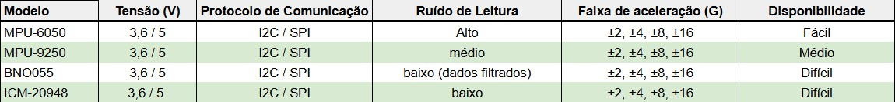
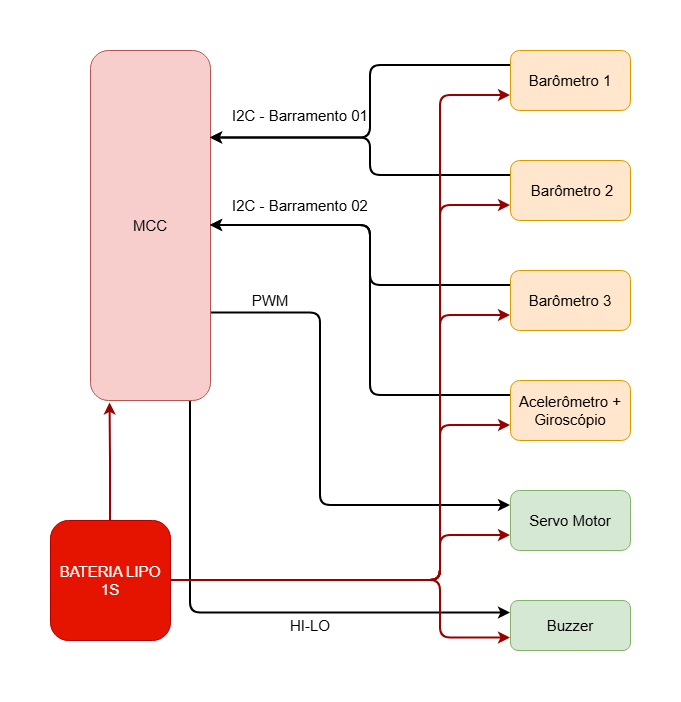

Etapa 1
#######

.. contents::
   :local:
   :depth: 2

Visão geral
***********

A Etapa 1 tem como objetivo definir os requisitos do sistema e selecionar os componentes que atendam às necessidades do projeto. Nessa etapa, são realizadas a pesquisa, a comparação e a aquisição dos principais dispositivos eletrônicos, bem como o levantamento das bibliotecas necessárias para o desenvolvimento do software embarcado.

Além da seleção dos componentes, também são estudados os sensores utilizados no sistema e elaborada a arquitetura inicial por meio de um diagrama de blocos, que servirá como base para as etapas posteriores do projeto.

Desenvolvimento
***************

O dispositivo desenvolvido deve ser capaz de medir a altitude do foguete com precisão e confiabilidade, detectar o apogeu do voo, acionar automaticamente o sistema de abertura do paraquedas e emitir um sinal sonoro após a aterrissagem para facilitar sua localização.

Para estimar a altitude, serão utilizados múltiplos sensores barométricos. As medições obtidas serão processadas por algoritmos de filtragem digital, reduzindo a influência de ruídos e aumentando a confiabilidade da estimativa. Para a detecção do apogeu, os dados provenientes dos barômetros serão combinados com as informações do acelerômetro. Após a identificação do momento adequado, um servomotor será acionado para liberar o mecanismo de abertura do paraquedas. Finalizada a aterrissagem, um buzzer emitirá sinais sonoros intermitentes para facilitar a recuperação do foguete. Todos os módulos serão alimentados por uma bateria LiPo de baixo peso, adequada às restrições da aplicação.

Com o objetivo de selecionar os sensores mais adequados, foi realizada uma comparação entre os principais modelos disponíveis no mercado, considerando critérios como faixa de operação, precisão, disponibilidade de bibliotecas, facilidade de aquisição e custo.

A **Figura 1** apresenta a comparação entre os barômetros avaliados.

Foram analisados seis modelos de barômetros disponíveis no mercado nacional e internacional. Considerando a disponibilidade para aquisição, a documentação técnica, a existência de bibliotecas consolidadas e a precisão exigida pela aplicação, o sensor BMP280 foi selecionado para o projeto [2][6].

A **Figura 2** apresenta a comparação entre os acelerômetros analisados.

Observa-se que os acelerômetros avaliados apresentam características semelhantes quanto à faixa de medição, tensão de operação e protocolo de comunicação. Dessa forma, critérios como custo, disponibilidade no mercado nacional, relação sinal-ruído (SNR) e disponibilidade de bibliotecas tornaram-se determinantes para a seleção do componente.

O modelo MPU6050 foi escolhido devido ao seu baixo custo, ampla disponibilidade e grande quantidade de bibliotecas disponíveis para desenvolvimento. Entretanto, esse sensor apresenta maior suscetibilidade a ruídos, tornando necessária a implementação de técnicas de filtragem para aumentar a confiabilidade das medições.

Componentes
============

`Ver componentes <Componentes.rst>`_

Diagrama de blocos
******************

A arquitetura elétrica e de comunicação do sistema embarcado é apresentada na **Figura 3**.

A bateria LiPo 1S é responsável por fornecer alimentação para todos os componentes do sistema, incluindo o microcontrolador, os três barômetros, o acelerômetro com giroscópio, o servomotor e o buzzer.

O microcontrolador central (MCC) realiza a aquisição dos dados dos sensores, o processamento das informações e o controle dos atuadores. Os três barômetros são conectados ao MCC por meio de dois barramentos I²C, permitindo redundância nas medições de altitude e aumentando a confiabilidade do sistema.

O acelerômetro e giroscópio também utilizam comunicação I²C. Os dados obtidos por esse sensor são combinados às informações dos barômetros para auxiliar na identificação do apogeu do foguete.

O servomotor é controlado pelo MCC por meio de um sinal PWM e é responsável pelo acionamento do mecanismo de abertura do paraquedas. O buzzer, por sua vez, é acionado por um sinal digital do tipo High/Low, emitindo alertas sonoros após a aterrissagem para facilitar a localização do foguete.

**Figura 3.** Diagrama de blocos da arquitetura do sistema embarcado.

Referências
***********

[1] nRF Connect SDK. https://developer.nordicsemi.com/nRF_Connect_SDK/doc/2.4.2/nrf/getting_started/modifying.html#configure-application

[2] BMP280 Datasheet. https://www.bosch-sensortec.com/media/boschsensortec/downloads/datasheets/bst-bmp280-ds001.pdf

[3] BMP180 Datasheet. https://cdn-shop.adafruit.com/datasheets/BST-BMP180-DS000-09.pdf

[4] BMP388 Datasheet. https://www.bosch-sensortec.com/media/boschsensortec/downloads/datasheets/bst-bmp388-ds001.pdf

[5] DPS310 Datasheet. https://br.mouser.com/pdfdocs/Infineon-DPS310-DS-v01_00-EN2.pdf

[6] Adafruit BMP280 Sensor Overview. https://cdn-learn.adafruit.com/downloads/pdf/adafruit-bmp280-barometric-pressure-plus-temperature-sensor-breakout.pdf

[7] DPS368 Datasheet. https://www.infineon.com/assets/row/public/documents/24/49/infineon-dps368-datasheet-en.pdf
