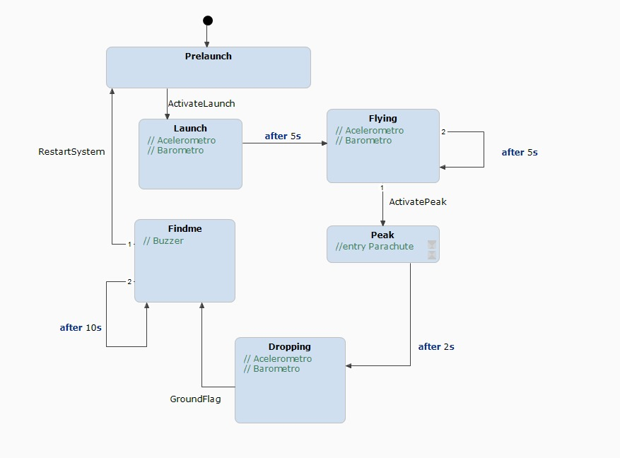

Etapa 2
#######

.. contents::
   :local:
   :depth: 2

Visão geral
***********

Para a etapa 2 serão realizadas as seguintes atividades:

1. Comunicação com o barômetro usando microcontrolador
2. Comunicação com o acelerômetro usando microcontrolador
3. Acionamento do buzzer usando microcontrolador
4. Acionamento do servo-motor usando microcontrolador
5. Esquemático preliminar
6. Máquina de estados do firmware

Segmentar as atividades desse modo vai permitir implementar e depurar de maneira individual, facilitando a integração final em etapas futuras. O item 5 visa elaborar o esquemático de uma PCB que vai integrar todos os módulos de sensores, incluindo sistemas de proteção e regulação de energia. 

Desenvolvimento
***************

Um dos pontos que levantou preocupação no sistema de energia foi o alta queda de tensão (Vdropout) dos reguladores lineares presentes nos módulos de sensoriamento e no kit de desenvolvimento do microcontrolador, de modo que há uma queda de tensão mínima quando os valores de tensão da entrada e da saída estão muito próximos. Este pode ser um problema pois ao usar uma bateria 1s completamente carregada a tensão de alimentação dos componentes fica inferior a 3,3 Volts se a queda for superior a 0,9 Volts. Para verificar se este é um problema relevante foi elaborado uma placa de testes que é alimentada por uma fonte de bancada, uma pequena carga resistiva e dois multímetros, um deles medindo a tensão de entrada do regulador e outro a tensão sobre a carga. Os resultados deste teste podem ser observados na tabela abaixo:

.. csv-table:: **Queda de Tensão Mínima entre Entrada e Saída**
   :header: "Vin (V)", "Vout (V)", "Diferença (V)"
   :widths: 10, 20, 20

   "5", "3,3", "1,7"
   "4,5", "3,3", "1,2"
   "4,2", "3,1", "1,1"
   "3,9", "2,8", "1,1"
   "3,6", "2,5", "1,1"
   "3,3", "2,2", "1,1"
   "3,0", "1,9", "1,1"

Podemos perceber que há uma diferença mínima de 1,1 Volts entre entrada e saída, valor dentro do esperado conforme o datasheet. Desse modo percebemos que não é possível alimentar diretamente a placa inteira com uma bateria 1s, por esse motivo foi escolhido usar uma bateria LiPo 2s com tensão nominal de 7,4 Volts. Para selecioanr corretamente uma bateria foi estipulado algumas diretrizes:

* Tensão nominal da Bateria (Vbat): 7,4V
* Tempo mínimo de operação desejado (t): 4 horas
* Tensão nominal do sistema (Vs): 3,3V
* Consumo médio do sistema (As): 100mA
* Fator de correção (Fc): 0,7
* Capacidade da bateria (Bc): valor a ser encontrado

O tempo mínimo de operação desejado foi um valor estipulado em 4 horas graças a experiências prévias na Olimpíada Brasileira de Astronomia. O consumo médio de 100mA foi um valor arbitrário baseado no consumo do ESP32 quando alguns do periféricos que mais consomem forem desativados. Neste cálculo não foi levado em conta o consumo dos sensores pois tipicamente são muitos baixos, e também não foi calculado o consumo do servo motor que apesar de ser alto, será ativado apenas por um breve momento e depois permanecerá estático. O comsumo é um valor bem crítico para a seleção da bateria correta e se possível deve passar por uma revisão no futuro quando a placa estiver em estágio de testes. O fator de correção de 0,7 foi um valor arbritário usado como margem de segurança no consumo médio do sistema e também como margem de capacidade pois não vamos descarregar totalmente a bateria a fim de manter sua saúde. Com estes valores temos:

Potência média (Pm) = Vs * As = 3,3 * 0,100 = 0,33W 

Energia total com fator de correção (Et) = Vbat * Bc * Fc => 7,4 * 0,300 * 0,7 = 1,554 Wh

Tempo mínimo de operação desejado (t) = Et / Pm => 1,554 / 0,33 = 4,7 Horas

Para elaborar o esquemático e layout da PCB foi utilizado o software KiCAD 10.0.1; 

Para elaborar a primeira versão da máquina de estados do firmware foi utilizado o software Itemis Create.

Testes
======

Teste 1: Buzzer --> `clique aqui <teste_buzzer>`_

Teste 2: Servomotor --> `clique aqui <teste_servo>`_

Teste 3: Acelerômetro --> `clique aqui <teste_acelerometro>`_

Teste 4: Barômetro --> `clique aqui <teste_barometro>`_

Layout da PCB
======

O esquemático e Layout da PCB se encontra abaixo...

Máquina de Estados do Firmware
======

A máquina de estados do firmware é gerada com o auxílio da ferramenta *Itemis Create*.  
Até o momento, foram definidos seis estados principais:

- **PreLaunch**
- **Launch**
- **Flying**
- **Peak**
- **Dropping**
- **FindMe**

Descrição dos Estados
---------------------

**PreLaunch**
   Estado responsável pela inicialização de todos os periféricos do sistema.

**Launch**
   Representa o momento de lançamento do foguete.  
   Neste estado, são coletadas as primeiras medições do acelerômetro e do barômetro.

**Flying**
   Estado de voo. As leituras dos sensores são realizadas periodicamente.  
   Este estado termina ao detectar o **Peak** (apogeu).

**Peak**
   Corresponde ao apogeu do voo.  
   Responsável pelo acionamento do servo para abertura do paraquedas.

**Dropping**
   Estado de descida. As leituras dos sensores continuam sendo feitas periodicamente.  
   Termina ao detectar a queda completa.

**FindMe**
   Estado final, no qual apenas o buzzer é acionado para facilitar a localização do foguete.  
   É encerrado manualmente pelo usuário ao encontrar o dispositivo.

os tempos anexados as "flags" de mudança de estado, são para fins de simulação apenas.

================================

Referências (links/datasheets/livros)
*************************************

- `Tutorial I2C ESP32 <https://microcontrollerslab.com/esp32-i2c-communication-tutorial-arduino-ide>`_
- `Tutorial Itemis Create <https://www.itemis.com/en/products/itemis-create/documentation/tutorials>`_
- `Documentação Espressif <https://docs.espressif.com/projects/esp-idf/en/latest/esp32/>`_
- `Documentação LED-C utilizado para programar o SG90 <https://docs.espressif.com/projects/esp-idf/en/latest/esp32/api-reference/peripherals/ledc.html>`_
- `Documentação I2C utilizado para programar o MPU6050 <https://docs.espressif.com/projects/esp-idf/en/latest/esp32/api-reference/peripherals/i2c.html>`_
- `Exemplos de programação ESP32 Espressif <https://github.com/espressif/esp-idf/tree/master/examples>`_

