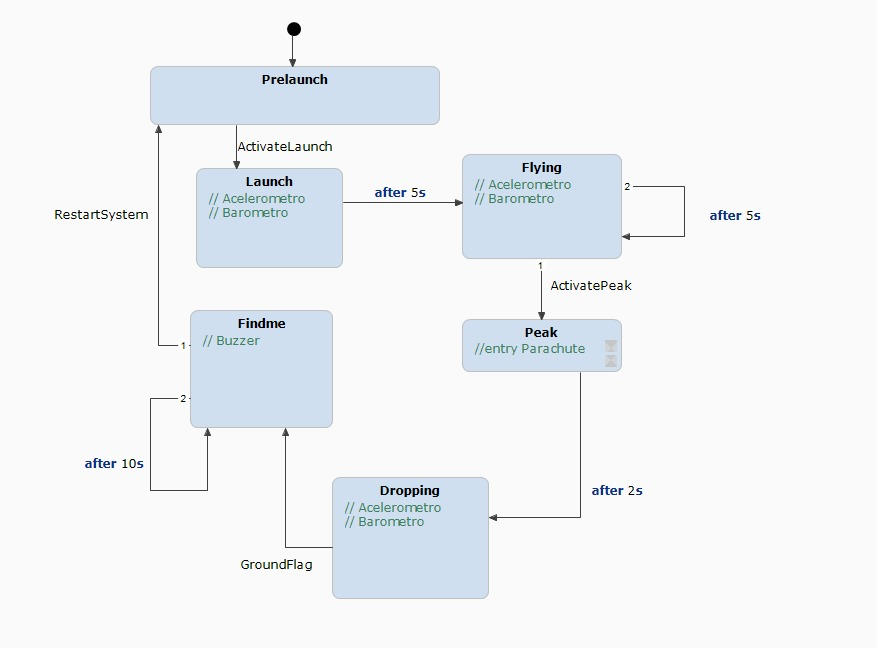

Etapa 2
#######

.. contents::
   :local:
   :depth: 2

Visão geral
***********

A Etapa 2 tem como objetivo validar individualmente os principais periféricos do sistema embarcado, permitindo que cada módulo seja desenvolvido e testado antes da integração completa do hardware e do firmware.

As atividades previstas nesta etapa são:

1. Comunicação com o barômetro utilizando o microcontrolador;
2. Comunicação com o acelerômetro utilizando o microcontrolador;
3. Acionamento do buzzer;
4. Acionamento do servomotor;
5. Desenvolvimento do esquemático preliminar da PCB;
6. Desenvolvimento da primeira versão da máquina de estados do firmware.

A implementação individual dos módulos reduz a complexidade da depuração e permite validar cada componente separadamente antes da montagem do sistema completo.

Além disso, esta etapa contempla o desenvolvimento inicial do esquemático da placa eletrônica, responsável por integrar todos os sensores, atuadores e circuitos de alimentação.

Desenvolvimento
***************

Durante o desenvolvimento do sistema foi identificada uma possível limitação relacionada à alimentação elétrica dos módulos utilizados. Os sensores e a placa de desenvolvimento empregam reguladores lineares de tensão que apresentam uma tensão mínima de operação (dropout voltage), fazendo com que a tensão de saída diminua quando a tensão de entrada se aproxima da tensão nominal de saída.

Como o projeto previa inicialmente a utilização de uma bateria LiPo 1S (3,7 V nominal), tornou-se necessário verificar experimentalmente se a tensão disponível seria suficiente para alimentar todo o sistema.

Para essa avaliação foi montada uma bancada composta por uma fonte de alimentação regulável, uma carga resistiva e dois multímetros digitais. Um multímetro foi utilizado para medir a tensão de entrada do regulador, enquanto o segundo monitorou a tensão de saída sobre a carga.

Os resultados obtidos são apresentados na **Tabela 1**.

.. csv-table:: **Tabela 1 – Queda de tensão entre entrada e saída do regulador**
   :header: "Vin (V)", "Vout (V)", "Diferença (V)"
   :widths: 10,20,20

   "5","3,3","1,7"
   "4,5","3,3","1,2"
   "4,2","3,1","1,1"
   "3,9","2,8","1,1"
   "3,6","2,5","1,1"
   "3,3","2,2","1,1"
   "3,0","1,9","1,1"

Os resultados mostram uma tensão mínima de aproximadamente 1,1 V entre entrada e saída, valor compatível com o especificado pelo fabricante do regulador utilizado.

Assim, conclui-se que uma bateria LiPo 1S não seria capaz de manter tensão suficiente durante toda sua faixa de descarga. Em função disso, foi adotada uma bateria LiPo 2S, com tensão nominal de 7,4 V.

Para dimensionar a capacidade mínima da bateria foram definidos os seguintes parâmetros de projeto:

* Tensão nominal da bateria: 7,4 V
* Tempo mínimo de operação: 4 h
* Tensão do sistema: 3,3 V
* Corrente média estimada: 100 mA
* Fator de segurança: 0,7

A potência média do sistema é dada por:

::

   P = V × I = 3,3 × 0,1 = 0,33 W

Considerando uma bateria de 300 mAh:

::

   E = 7,4 × 0,3 × 0,7 = 1,554 Wh

Assim, o tempo estimado de operação é:

::

   t = 1,554 / 0,33 = 4,7 horas

Esse resultado atende ao requisito mínimo de autonomia estabelecido para o projeto.

O desenvolvimento do esquemático eletrônico foi realizado utilizando o software KiCad 10.0.1.

A máquina de estados do firmware foi desenvolvida utilizando a ferramenta Itemis Create, conforme documentação apresentada em [2].

Testes
======

Cada periférico foi validado individualmente antes da integração completa do sistema.

Durante os testes foram verificados:

* inicialização correta do dispositivo;
* comunicação entre o ESP32 e o periférico;
* funcionamento esperado;
* ausência de erros de comunicação.

Os resultados completos podem ser consultados nas páginas específicas:

Teste 1: Buzzer --> `clique aqui <teste_buzzer>`_

Teste 2: Servomotor --> `clique aqui <teste_servo>`_

Teste 3: Acelerômetro --> `clique aqui <teste_acelerometro>`_

Teste 4: Barômetro --> `clique aqui <teste_bar>`_

Cada página apresenta:

* Conexões de hardware;
* Estrutura do projeto;
* Descrição;
* Referências;

Layout da PCB
=============

O esquemático e o layout preliminar da PCB foram desenvolvidos utilizando o software KiCad.

Essa primeira versão possui como objetivo validar a integração elétrica entre os sensores, microcontrolador, reguladores de tensão e atuadores antes da fabricação da placa definitiva.

PCB --> `clique aqui <KiCAD_PCB>`_

Máquina de Estados do Firmware
==============================

A primeira versão da máquina de estados foi desenvolvida utilizando a ferramenta Itemis Create.

A arquitetura proposta é apresentada na **Figura 1**.

**Figura 1.** Máquina de estados utilizada pelo firmware.

Foram definidos seis estados principais:

- PreLaunch
- Launch
- Flying
- Peak
- Dropping
- FindMe

Descrição dos Estados
---------------------

**PreLaunch**

Inicializa todos os periféricos, verifica o funcionamento dos sensores e aguarda a condição de lançamento.

**Launch**

Estado iniciado quando é detectada aceleração compatível com o lançamento do foguete.

**Flying**

Realiza continuamente a leitura dos sensores e estima a altitude durante o voo.

**Peak**

Detecta o apogeu e aciona o servomotor para abertura do paraquedas.

**Dropping**

Monitora a descida até detectar a aterrissagem.

**FindMe**

Após a aterrissagem, aciona o buzzer de forma intermitente para facilitar a localização do foguete.

Transições
----------

As transições entre os estados são determinadas pelas leituras dos sensores.

* **PreLaunch → Launch:** aceleração acima do limiar de lançamento durante um intervalo mínimo.

* **Launch → Flying:** confirmação de que o foguete permanece em voo.

* **Flying → Peak:** detecção do apogeu por meio da análise conjunta da altitude barométrica e da aceleração vertical.

* **Peak → Dropping:** após o acionamento do servomotor.

* **Dropping → FindMe:** altitude estável durante determinado intervalo de tempo, indicando aterrissagem.

Os tempos apresentados nas condições de transição foram utilizados apenas para simulação durante o desenvolvimento da máquina de estados.

Documentação do Firmware
========================

O firmware foi organizado de forma modular, separando as funções de cada periférico em arquivos independentes.

Cada driver é responsável pela inicialização e comunicação com seu respectivo dispositivo, enquanto a máquina de estados coordena o comportamento geral do sistema.

Essa organização facilita futuras manutenções, reutilização de código e integração dos módulos desenvolvidos.

Referências
***********

[1] `Tutorial I2C ESP32 <https://microcontrollerslab.com/esp32-i2c-communication-tutorial-arduino-ide>`_

[2] `Tutorial Itemis Create <https://www.itemis.com/en/products/itemis-create/documentation/tutorials>`_

[3] `Documentação Espressif <https://docs.espressif.com/projects/esp-idf/en/latest/esp32/>`_

[4] `Documentação LED-C utilizado para programar o SG90 <https://docs.espressif.com/projects/esp-idf/en/latest/esp32/api-reference/peripherals/ledc.html>`_

[5] `Documentação I2C utilizado para programar o MPU6050 <https://docs.espressif.com/projects/esp-idf/en/latest/esp32/api-reference/peripherals/i2c.html>`_

[6] `Exemplos de programação ESP32 Espressif <https://github.com/espressif/esp-idf/tree/master/examples>`_

[7] `ESP32 as I2C Master <https://www.youtube.com/watch?v=Snp6iTu1R7E>`_
