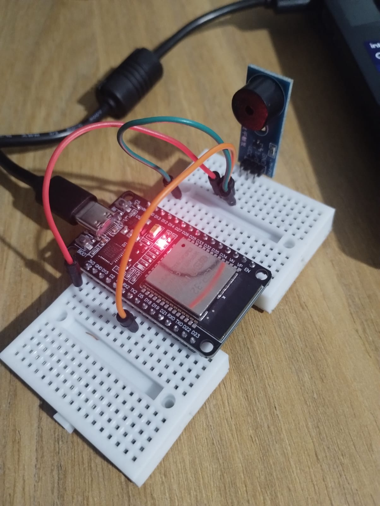

Teste do Buzzer
===============

Inicialmente, nossa intenção é testar algumas funções (não todas) que serão utilizadas no projeto, além de estabelecer um ponto de partida para os próximos desenvolvimentos envolvendo o componente buzzer.

No início, foram criadas duas funções principais para o teste:

- **buzzer_1bip**: Emite um bip único. Essa função será utilizada repetidamente durante a *última fase* da máquina de estados, na qual um sinal sonoro é emitido periodicamente para auxiliar na localização do foguete.

- **buzzer_DoneInit**: Emite uma sequência de três bips. Essa função indica que a inicialização dos periféricos foi concluída com sucesso e que o sistema está pronto para prosseguir com o lançamento. Será utilizada no estado de pré-lançamento.

Para o desenvolvimento deste teste, foi utilizado o **VS Code** com a extensão do **ESP-IDF**.

Setup de teste:

