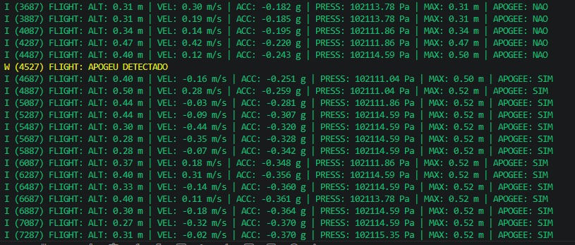

Telemetria para Foguetes com ESP32
==================================

.. contents::
   :local:
   :depth: 2

Objetivos da Etapa
------------------

Esta etapa teve como objetivo desenvolver e validar a primeira versão do algoritmo responsável pela identificação automática do apogeu do foguete. Para isso, foram implementados os módulos de aquisição dos sensores, estimação da altitude, filtragem das leituras, cálculo da velocidade vertical e detecção do ponto de altitude máxima.

Além do algoritmo de detecção, foi desenvolvida a estrutura responsável pela aquisição e transmissão dos dados pela interface serial (UART), permitindo acompanhar o comportamento do sistema durante os testes em bancada e fornecendo uma base para a integração com a máquina de estados e os demais módulos do firmware.

Visão Geral
-----------

Este módulo implementa a primeira versão do sistema de aquisição e processamento dos dados de voo do foguete. O objetivo é realizar a leitura dos sensores, estimar a altitude, calcular a velocidade vertical e detectar automaticamente o apogeu, disponibilizando essas informações para as próximas etapas do projeto.

Nesta versão, a transmissão dos dados é realizada por meio da interface serial (UART), permitindo acompanhar em tempo real o comportamento do algoritmo durante os testes em bancada. O armazenamento permanente dos dados utilizando a memória NVS e a integração com os demais módulos do firmware serão implementados nas próximas etapas do projeto.

Conexões de Hardware
--------------------

ESP32 DevKit:

- GPIO 21 → SDA (BMP280 e MPU6050)
- GPIO 22 → SCL (BMP280 e MPU6050)
- 3V3 → VCC (BMP280 e MPU6050)
- 3V3 → CSB (BMP280)
- GND → GND (BMP280 e MPU6050)
- GND → SDO (BMP280)
- GND → AD0 (MPU6050)

Sensores utilizados neste teste:

- 1 × BMP280
- 1 × MPU6050

Estrutura do Projeto
--------------------

::

    main/
     ├── main.c
     ├── flight_controller.c
     ├── flight_controller.h
     └── drivers/
          ├── bmp280/
          ├── mpu6050/
          └── i2c/

O módulo ``flight_controller`` concentra toda a lógica responsável pelo processamento dos dados de voo. Ele realiza a aquisição dos sensores, a calibração inicial, a filtragem das medições, a estimação da altitude e da velocidade vertical, a detecção automática do apogeu e o compartilhamento dessas informações com os demais módulos do firmware.

Funcionamento do Sistema
------------------------

O firmware foi desenvolvido utilizando o framework ESP-IDF [1] e o sistema operacional FreeRTOS [2].

O processamento executado pelo sistema pode ser resumido pelo fluxo apresentado a seguir.

::

               BMP280                 MPU6050
                  │                      │
                  │                      │
                  └──────────┬───────────┘
                             │
                             ▼
                 Aquisição dos sensores
                             │
                             ▼
                 Calibração inicial
                             │
                             ▼
                 Filtragem das medições (pressão, aceleração e velocidade)
                             │
                             ▼
                 Estimativa da altitude (Equação barométrica)
                             │
                             ▼
                 Estimativa da velocidade vertical (Combinação entre aceleração integrada e velocidade barométrica)
                             │
                             ▼
                 Verificação do apogeu
                             │
                             ▼
                 Transmissão via UART

Calibração dos Sensores
-----------------------

Antes do início da operação, o firmware executa uma rotina de calibração responsável por determinar os valores de referência utilizados durante todo o voo.

No caso do BMP280, são adquiridas 100 amostras consecutivas da pressão atmosférica enquanto o foguete permanece em repouso na base de lançamento. A média dessas medições é utilizada como pressão de referência para a aplicação da equação barométrica, permitindo estimar a altitude relativa ao ponto de lançamento.

Para o MPU6050, são coletadas 200 amostras consecutivas da aceleração com o sistema completamente parado. A média dessas medições corresponde ao offset presente em cada eixo do acelerômetro, sendo posteriormente subtraída das leituras durante a execução do firmware.

Após a calibração, todas as estimativas de altitude, velocidade vertical e detecção do apogeu passam a utilizar esses valores de referência, reduzindo a influência de pequenas diferenças entre sensores e das condições ambientais presentes no momento do lançamento.

Aquisição dos Sensores
----------------------

A comunicação entre o ESP32 e os sensores é realizada por meio do barramento I²C utilizando os drivers disponibilizados pela ESP-IDF [3].

O BMP280 fornece medições de pressão atmosférica e temperatura [5], enquanto o MPU6050 fornece medições da aceleração nos três eixos [6].

A altitude não é medida diretamente pelo sistema. Ela é estimada a partir da pressão atmosférica utilizando a equação barométrica e a pressão de referência obtida durante a calibração inicial.

As informações fornecidas pelos sensores são utilizadas em diferentes etapas do algoritmo, conforme apresentado na Tabela 1.

+-----------+-----------------------------+--------------------------------------------+
| Sensor    | Grandeza medida             | Utilização no algoritmo                    |
+===========+=============================+============================================+
| BMP280    | Pressão e temperatura       | Estimativa da altitude barométrica         |
+-----------+-----------------------------+--------------------------------------------+
| MPU6050   | Aceleração nos três eixos   | Estimativa da velocidade vertical          |
+-----------+-----------------------------+--------------------------------------------+

**Tabela 1.** Sensores utilizados pelo algoritmo de detecção de apogeu e suas respectivas funções.

Filtragem das Leituras
----------------------

As medições fornecidas pelos sensores apresentam oscilações decorrentes do ruído eletrônico, vibrações estruturais do foguete e pequenas variações instantâneas das grandezas medidas.

Para reduzir esses efeitos, foram implementados filtros de média móvel utilizando uma janela de quinze amostras. Diferentemente de uma filtragem aplicada apenas à altitude, o algoritmo realiza o processamento individual de três variáveis distintas:

* altitude estimada pelo BMP280;
* aceleração medida pelo MPU6050;
* velocidade vertical estimada.

Essa estratégia permite reduzir oscilações em diferentes etapas do processamento, fornecendo informações mais estáveis para o algoritmo de detecção do apogeu sem comprometer significativamente seu tempo de resposta.

Estimativa da Velocidade Vertical
---------------------------------

A velocidade vertical não é medida diretamente pelos sensores, sendo estimada a partir de duas abordagens complementares.

Inicialmente, é realizada a integração numérica da aceleração medida pelo MPU6050. Em paralelo, também é calculada uma estimativa da velocidade utilizando a taxa de variação da altitude obtida pelo BMP280.

A estimativa final da velocidade vertical é obtida pela combinação ponderada entre essas duas informações, conforme ilustrado abaixo.

::

        MPU6050                    BMP280
           │                          │
           ▼                          ▼
  Integral da aceleração     Derivada da altitude
           │                          │
           └──────────┬───────────────┘
                      │
                      ▼
             Combinação ponderada
                      │
                      ▼
        Estimativa da velocidade

Os coeficientes utilizados nessa combinação foram definidos experimentalmente durante os testes em bancada, atribuindo peso de **0,35** para a velocidade proveniente da integração da aceleração e **0,65** para a velocidade calculada a partir da altitude barométrica.

Foi atribuído maior peso às estimativas provenientes do barômetro devido à maior estabilidade das medições de altitude, enquanto o acelerômetro está mais sujeito aos efeitos de vibrações e ao acúmulo de erros decorrente da integração numérica da aceleração.

Durante a integração da aceleração também é aplicado um fator de escala definido experimentalmente, reduzindo a influência do erro acumulado ao longo do tempo. Esse parâmetro poderá ser refinado após os primeiros ensaios em voo.

Após o cálculo da velocidade, também é aplicado um filtro de média móvel, reduzindo pequenas oscilações que poderiam provocar falsas detecções do apogeu.

Parâmetros do Algoritmo
-----------------------

Os principais parâmetros utilizados pelo algoritmo são apresentados na Tabela 2.

+--------------------------------------+----------------------+
| Parâmetro                            | Valor                |
+======================================+======================+
| Período da Sensor Task               | 20 ms (50 Hz)        |
+--------------------------------------+----------------------+
| Período da Telemetry Task            | 200 ms (5 Hz)        |
+--------------------------------------+----------------------+
| Janela da média móvel                | 15 amostras          |
+--------------------------------------+----------------------+
| Peso do acelerômetro                 | 0,35                 |
+--------------------------------------+----------------------+
| Peso do barômetro                    | 0,65                 |
+--------------------------------------+----------------------+
| Altitude mínima para detectar apogeu | 0,15 m               |
+--------------------------------------+----------------------+
| Limite de velocidade vertical        | -0,03 m/s            |
+--------------------------------------+----------------------+
| Limite de aceleração                 | -0,02 g              |
+--------------------------------------+----------------------+

**Tabela 2.** Principais parâmetros utilizados pelo algoritmo de detecção de apogeu.

Detecção de Apogeu
------------------

Após o processamento das leituras, o firmware verifica continuamente se o foguete atingiu o ponto de altitude máxima.

Para evitar falsas detecções provocadas por oscilações momentâneas dos sensores, o algoritmo considera simultaneamente informações de altitude, velocidade vertical e aceleração.

A detecção do apogeu ocorre somente quando todas as seguintes condições são satisfeitas:

* altitude superior a **0,15 m**;
* velocidade vertical inferior a **-0,03 m/s**, indicando o início da descida;
* aceleração vertical inferior a **-0,02 g**, compatível com a transição entre a fase de subida e a fase de descida.

Além desses critérios, velocidades muito próximas de zero são consideradas nulas antes da etapa de decisão, reduzindo oscilações numéricas próximas ao ponto de inversão da trajetória.

Os critérios utilizados pelo algoritmo são resumidos na Tabela 3.

+----------------------------------------+-----------------------------------------------+
| Critério                               | Finalidade                                    |
+========================================+===============================================+
| Altitude superior a 0,15 m             | Evita detecção durante a inicialização        |
+----------------------------------------+-----------------------------------------------+
| Velocidade inferior a -0,03 m/s        | Identifica o início da descida                |
+----------------------------------------+-----------------------------------------------+
| Aceleração inferior a -0,02 g          | Confirma a mudança de fase do voo             |
+----------------------------------------+-----------------------------------------------+

**Tabela 3.** Critérios utilizados para a detecção automática do apogeu.

De forma simplificada, o algoritmo executa continuamente o procedimento descrito abaixo.

::

    Enquanto o sistema estiver em execução

        Ler BMP280

        Ler MPU6050

        Filtrar altitude

        Filtrar aceleração

        Estimar velocidade

        Filtrar velocidade

        Se:

            altitude > 0,15 m

            velocidade < -0,03 m/s

            aceleração < -0,02 g

        Então:

            Detectar apogeu

            Armazenar a maior altitude obtida

Arquitetura do Firmware
-----------------------

O firmware foi desenvolvido utilizando o sistema operacional FreeRTOS, permitindo que a aquisição dos sensores e a transmissão das informações sejam executadas de forma concorrente e independente.

Nesta versão do projeto foram implementadas duas tarefas principais, apresentadas na Tabela 4.

+------------------+----------------+--------------------------------------------------------------+
| Task             | Frequência     | Responsabilidade                                             |
+==================+================+==============================================================+
| Sensor Task      | 20 ms (50 Hz)  | Realiza a leitura dos sensores, executa a calibração, aplica |
|                  |                | os filtros, estima altitude e velocidade vertical, verifica  |
|                  |                | os critérios de detecção do apogeu e atualiza a estrutura de |
|                  |                | telemetria compartilhada.                                    |
+------------------+----------------+--------------------------------------------------------------+
| Telemetry Task   | 200 ms (5 Hz)  | Realiza a transmissão das informações processadas pela       |
|                  |                | interface UART, permitindo acompanhar em tempo real o        |
|                  |                | funcionamento do algoritmo durante os testes em bancada.     |
+------------------+----------------+--------------------------------------------------------------+

**Tabela 4.** Organização das tarefas implementadas utilizando o FreeRTOS.

A separação entre aquisição dos sensores e transmissão serial impede que atrasos na comunicação afetem a frequência de execução do algoritmo responsável pela detecção do apogeu.

As duas tarefas compartilham uma estrutura comum contendo as principais informações do voo, como altitude, velocidade vertical, aceleração e estado da detecção do apogeu. Para evitar condições de corrida durante o acesso simultâneo a essa estrutura é utilizado um mutex, garantindo acesso exclusivo aos dados durante operações críticas.

Log de Funcionamento
--------------------

Para validar o algoritmo de detecção de apogeu foi realizado um ensaio em bancada utilizando um sensor BMP280 e um MPU6050.

Como não era possível reproduzir uma trajetória completa de voo em ambiente de testes, foi realizado um deslocamento vertical controlado, simulando as fases de subida e descida do foguete.

A **Figura 1** apresenta o monitor serial durante um dos ensaios realizados.

Quando as condições estabelecidas pelo algoritmo são satisfeitas, o firmware identifica corretamente o apogeu, registra o evento e mantém armazenado o maior valor de altitude estimado (**max_altitude**), informação que poderá ser utilizada posteriormente pela máquina de estados e pelos módulos de armazenamento de dados.

**Figura 1.** Resultado do algoritmo de detecção de apogeu durante um teste em bancada.

Os resultados obtidos demonstram que a combinação das informações provenientes do BMP280 e do MPU6050 foi capaz de identificar corretamente o ponto de altitude máxima nas condições simuladas, validando a abordagem adotada antes da realização dos primeiros testes em voo.

Limitações Atuais
-----------------

Nesta etapa, o algoritmo foi validado apenas em ensaios realizados em bancada utilizando um único sensor BMP280 e um MPU6050.

Embora os resultados tenham demonstrado o correto funcionamento do algoritmo, os limiares utilizados para a detecção do apogeu e os coeficientes empregados na estimativa da velocidade vertical foram definidos experimentalmente e poderão ser refinados após os primeiros ensaios em voo.

Além disso, a arquitetura definitiva do altímetro utilizará três sensores barométricos operando em conjunto. A implementação desse sistema de fusão de sensores é apresentada na subentrega **Filtros_Barômetros**, permitindo aumentar a robustez das estimativas de altitude empregadas pelo algoritmo de navegação.

Conclusão
---------

Ao final desta etapa foi desenvolvida a primeira versão funcional do algoritmo de detecção automática do apogeu do foguete.

Foram implementados os módulos responsáveis pela aquisição dos sensores, calibração inicial, filtragem das medições, estimação da altitude e da velocidade vertical, além da identificação automática do ponto de altitude máxima.

A utilização de uma arquitetura baseada em tarefas do FreeRTOS permitiu separar o processamento dos sensores da transmissão serial, preservando a frequência de execução do algoritmo e facilitando sua integração com os demais módulos do firmware.

Os resultados obtidos em bancada demonstraram o correto funcionamento da solução proposta, estabelecendo uma base sólida para as próximas etapas do projeto, que incluem a integração completa com a máquina de estados, armazenamento permanente dos dados e validação do sistema em ensaios de voo.

Referências
-----------

[1] `Documentação ESP-IDF <https://docs.espressif.com/projects/esp-idf/en/latest/esp32/>`_

[2] `Documentação FreeRTOS <https://www.freertos.org/Documentation/RTOS_book.html>`_

[3] `Documentação I²C ESP32 <https://docs.espressif.com/projects/esp-idf/en/latest/esp32/api-reference/peripherals/i2c.html>`_

[4] `Exemplos ESP-IDF Espressif <https://github.com/espressif/esp-idf/tree/master/examples>`_

[5] `Datasheet BMP280 <https://www.bosch-sensortec.com/products/environmental-sensors/pressure-sensors/bmp280/>`_

[6] `Datasheet MPU6050 <https://invensense.tdk.com/products/motion-tracking/6-axis/mpu-6050/>`_

