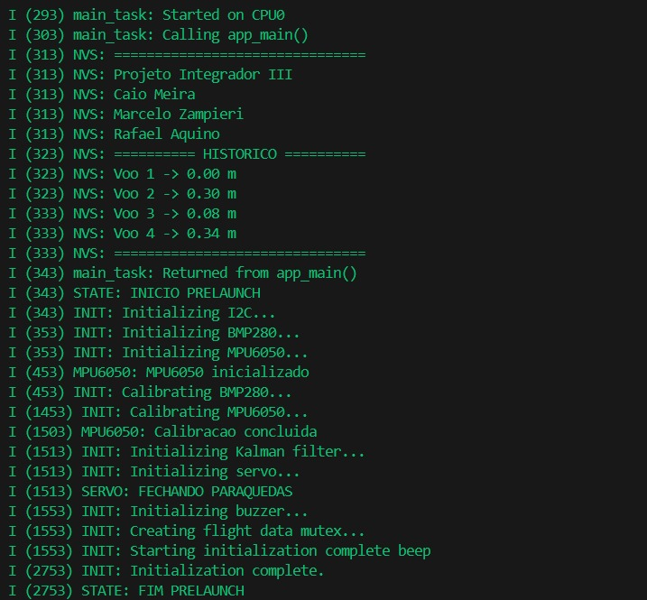
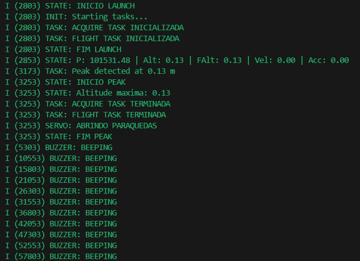

Código Final
############

.. contents::
   :local:
   :depth: 2

Visão Geral
***********

Esta etapa apresenta a versão integrada do firmware do altímetro de foguete, reunindo os módulos desenvolvidos ao longo do projeto em uma única aplicação embarcada executada sobre o ESP32 utilizando o ESP-IDF e o FreeRTOS.

O firmware foi desenvolvido seguindo uma arquitetura modular, na qual cada diretório possui uma responsabilidade específica. Essa organização reduz o acoplamento entre os componentes, facilita a manutenção do código e permite que novos sensores ou funcionalidades sejam incorporados com pequenas alterações na estrutura existente.

Estrutura do Projeto
********************

A Figura 1 apresenta a organização simplificada dos principais arquivos que compõem o firmware.

::

    main/
    ├── drivers/
    │   ├── bmp280.c
    │   ├── bmp280.h
    │   ├── buzzer.c
    │   ├── buzzer.h
    │   ├── i2c_helper.c
    │   ├── i2c_helper.h
    │   ├── mpu6050.c
    │   ├── mpu6050.h
    │   ├── nvs_storage.c
    │   ├── nvs_storage.h
    │   ├── sensor_context.c
    │   ├── sensor_context.h
    │   ├── servo.c
    │   └── servo.h
    ├── filter/
    │   ├── kalman_altitude.c
    │   └── kalman_altitude.h
    ├── statemachine/
    │   ├── statemachine.c
    │   └── statemachine.h
    ├── tasks/
    │   ├── acquire_task.c
    │   ├── acquire_task.h
    │   ├── flight_task.c
    │   ├── flight_task.h
    │   ├── init_task.c
    │   └── init_task.h
    ├── flight_data.h
    └── main.c

Figura 1 – Estrutura simplificada do firmware.

A Tabela 1 resume a responsabilidade de cada diretório do projeto.

+-------------------+-----------------------------------------------------+
| Diretório         | Responsabilidade                                    |
+===================+=====================================================+
| drivers           | Drivers dos periféricos e recursos compartilhados.  |
+-------------------+-----------------------------------------------------+
| filter            | Algoritmos de filtragem e estimação.                |
+-------------------+-----------------------------------------------------+
| tasks             | Tarefas executadas pelo FreeRTOS.                   |
+-------------------+-----------------------------------------------------+
| statemachine      | Controle da aplicação por máquina de estados.       |
+-------------------+-----------------------------------------------------+
| main.c            | Inicialização da aplicação.                         |
+-------------------+-----------------------------------------------------+
| flight_data.h     | Estrutura compartilhada dos dados de voo.           |
+-------------------+-----------------------------------------------------+

Tabela 1 – Organização dos módulos do firmware.

Funcionamento Geral
*******************

A execução do firmware inicia no arquivo ``main.c``, responsável pela inicialização da memória não volátil (NVS) e pelo início da máquina de estados. A partir desse momento, a máquina de estados executa a inicialização do hardware por meio da função ``init_task()`` e controla a criação e remoção das tarefas responsáveis pela aquisição dos sensores e pelo processamento das informações de voo.

A Figura 2 apresenta o fluxo de inicialização implementado no firmware.

   Figura 2 – Fluxo de inicialização do firmware.

Arquivos Principais
*******************

main.c
=======

O arquivo ``main.c`` constitui o ponto de entrada da aplicação.

Sua principal responsabilidade é inicializar a memória não volátil utilizada para armazenamento dos parâmetros do sistema e iniciar a máquina de estados responsável pelo gerenciamento do firmware.

flight_data.h
=============

O arquivo ``flight_data.h`` define a estrutura compartilhada utilizada pelos diferentes módulos do firmware.

Nessa estrutura são armazenadas as medições adquiridas pelos sensores, bem como as variáveis processadas pelo filtro de Kalman, como altitude filtrada e velocidade vertical, permitindo o compartilhamento dessas informações entre as tarefas do firmware.

statemachine/
=============

Este diretório implementa a máquina de estados responsável pelo controle do firmware.

A máquina de estados organiza a sequência de execução da aplicação, controlando a inicialização dos módulos e o acionamento das tarefas durante o funcionamento do sistema.

O arquivo ``statemachine.c`` contém a implementação da lógica de controle e das transições entre estados, enquanto ``statemachine.h`` disponibiliza a interface utilizada pelos demais módulos.

A Figura 3 apresenta o diagrama da máquina de estados implementada no projeto.

   Figura 3 – Máquina de estados utilizada pelo firmware.

tasks/
======

O diretório ``tasks`` reúne as tarefas executadas pelo FreeRTOS, sendo responsável pela organização do processamento concorrente do firmware. Cada tarefa possui uma responsabilidade específica, permitindo separar a inicialização do sistema, a aquisição dos sensores e o processamento das informações de voo.

A Tabela 2 apresenta um resumo das tarefas implementadas.

+------------------+------------------------------------------------------+
| Arquivo          | Responsabilidade                                     |
+==================+======================================================+
| init_task        | Inicialização dos periféricos do sistema.            |
+------------------+------------------------------------------------------+
| acquire_task     | Aquisição periódica dos sensores.                    |
+------------------+------------------------------------------------------+
| flight_task      | Processamento das informações de voo.                |
+------------------+------------------------------------------------------+

Tabela 2 – Tarefas implementadas no firmware.

init_task.c / init_task.h
=========================

O módulo ``init_task`` é responsável pela inicialização de todos os periféricos utilizados pelo firmware.

Durante sua execução são configurados os barramentos de comunicação, sensores, dispositivos de saída e demais recursos necessários para o funcionamento do sistema. Após a conclusão da inicialização, o módulo sinaliza que os recursos estão disponíveis para utilização pelas demais tarefas.

O arquivo ``init_task.h`` define a interface pública utilizada pela máquina de estados para inicialização do sistema.

Embora o módulo mantenha o nome init_task, sua implementação foi adaptada para funcionar como uma função de inicialização, e não como uma tarefa do FreeRTOS. Essa alteração foi realizada porque a configuração e calibração dos periféricos são necessárias apenas uma única vez durante a inicialização do firmware. O nome do módulo foi preservado para manter a padronização da arquitetura do projeto e evitar alterações desnecessárias no restante do código.

acquire_task.c / acquire_task.h
===============================

O módulo ``acquire_task`` implementa a tarefa responsável pela aquisição periódica dos sensores.

Durante sua execução são realizadas as leituras dos três sensores BMP280 e do acelerômetro MPU6050. Em seguida, os dados são processados pelo filtro de Kalman para estimativa da altitude e da velocidade vertical, sendo posteriormente armazenados na estrutura compartilhada ``g_flight_data``.

O arquivo ``acquire_task.h`` disponibiliza os protótipos das funções e estruturas necessárias para criação e gerenciamento da tarefa.

flight_task.c / flight_task.h
=============================

O módulo ``flight_task`` concentra a lógica de processamento relacionada ao voo do foguete.

Esta tarefa utiliza os dados previamente processados e armazenados em ``g_flight_data`` para executar o algoritmo de detecção de apogeu, atualizar a estrutura ``g_flight_status`` e armazenar a altitude máxima na memória não volátil quando o apogeu é identificado.

O arquivo ``flight_task.h`` define a interface pública utilizada para criação da tarefa e acesso às suas funções.

drivers/
========

O diretório ``drivers`` reúne os módulos responsáveis pela comunicação direta com os periféricos do hardware, encapsulando detalhes específicos de cada dispositivo e disponibilizando uma interface padronizada para o restante do firmware.

A Tabela 3 apresenta um resumo dos drivers implementados.

+----------------------+------------------------------------------------+
| Driver               | Função principal                               |
+======================+================================================+
| bmp280               | Comunicação com os barômetros.                 |
+----------------------+------------------------------------------------+
| mpu6050              | Comunicação com o acelerômetro.                |
+----------------------+------------------------------------------------+
| i2c_helper           | Configuração do barramento I²C.                |
+----------------------+------------------------------------------------+
| servo                | Controle do servomotor.                        |
+----------------------+------------------------------------------------+
| buzzer               | Controle do buzzer.                            |
+----------------------+------------------------------------------------+
| nvs_storage          | Armazenamento em memória não volátil.          |
+----------------------+------------------------------------------------+
| sensor_context       | Armazenamento das instâncias dos sensores e do |
|                      | filtro de Kalman.                              |
+----------------------+------------------------------------------------+

Tabela 3 – Drivers implementados no firmware.

bmp280.c / bmp280.h
-------------------

Implementam o driver responsável pela configuração dos sensores BMP280 e pela aquisição das medições de pressão e temperatura.

O arquivo de cabeçalho define as estruturas de dados, constantes e funções utilizadas pelos demais módulos.

mpu6050.c / mpu6050.h
---------------------

Implementam a comunicação com o acelerômetro MPU6050, realizando sua configuração e aquisição das medições de aceleração utilizadas durante o processamento do voo.

O arquivo ``mpu6050.h`` disponibiliza a interface pública do driver.

i2c_helper.c / i2c_helper.h
---------------------------

Implementam funções auxiliares para configuração e utilização do barramento I²C empregado pelos sensores do sistema.

A centralização dessas funções reduz a duplicação de código e simplifica a manutenção do firmware.

servo.c / servo.h
-----------------

Implementam as funções responsáveis pelo acionamento do servomotor do sistema de recuperação utilizando o periférico LEDC do ESP32 para geração do sinal PWM.

O arquivo de cabeçalho define a interface utilizada pelos demais módulos para controle do servo.

buzzer.c / buzzer.h
-------------------

Implementam o controle do buzzer utilizado para sinalização sonora durante a operação do sistema.

A interface pública disponibiliza funções para emissão dos diferentes padrões sonoros empregados durante os testes e operação do firmware.

nvs_storage.c / nvs_storage.h
-----------------------------

Implementam as funções responsáveis pelo armazenamento e recuperação de informações utilizando a memória não volátil (NVS) do ESP32.

Esse módulo permite preservar parâmetros importantes entre reinicializações do sistema.

sensor_context.c / sensor_context.h
-----------------------------------

Implementam a estrutura compartilhada que armazena as instâncias dos sensores BMP280, do acelerômetro MPU6050 e do filtro de Kalman.

Esse módulo centraliza o acesso aos periféricos e aos algoritmos de processamento utilizados pelas tarefas do firmware.

filter/
========

O diretório ``filter`` reúne os algoritmos responsáveis pelo processamento dos dados provenientes dos sensores antes que essas informações sejam utilizadas pelos demais módulos do firmware.

A separação dos algoritmos de processamento em um módulo específico reduz o acoplamento entre os componentes do sistema e facilita a implementação de novas técnicas de filtragem ou estimação sem impactar os drivers ou as tarefas do FreeRTOS.

kalman_altitude.c / kalman_altitude.h
-------------------------------------

Este módulo implementa o filtro de Kalman utilizado para estimar a altitude e a velocidade vertical do foguete a partir das medições realizadas pelos sensores.

O algoritmo combina as informações disponíveis para reduzir a influência dos ruídos presentes nas leituras barométricas, produzindo estimativas mais estáveis das variáveis de interesse. Essas estimativas são posteriormente utilizadas pelos algoritmos responsáveis pelo monitoramento do voo.

O arquivo ``kalman_altitude.h`` define as estruturas de dados, constantes e protótipos das funções utilizadas pelos demais módulos do firmware.

Arquitetura do firmware
**********************

A Figura 4 apresenta o fluxo simplificado de execução do firmware.

::

init_task()
      │
      ▼
acquire_task
      │
      ▼
Leitura dos sensores
      │
      ▼
Filtro de Kalman
      │
      ▼
g_flight_data
      │
      ▼
flight_task
      │
      ▼
Detecção de Apogeu
      │
      ▼
g_flight_status

Figura 4 – Arquitetura simplificada do firmware e fluxo de informações entre os módulos.

Considerações Finais
********************

A arquitetura modular adotada neste firmware permitiu separar claramente as responsabilidades entre aquisição de dados, processamento das informações, gerenciamento das tarefas, controle da máquina de estados e comunicação com o hardware.

A utilização de interfaces bem definidas por meio dos arquivos de cabeçalho (``.h``) reduz o acoplamento entre os módulos, enquanto a implementação distribuída em arquivos de código-fonte (``.c``) facilita a manutenção, os testes individuais e a evolução do projeto.

Essa organização também simplifica a incorporação de novos sensores, algoritmos de processamento e funcionalidades futuras, mantendo a estrutura do firmware escalável e de fácil manutenção.

Referências
***********

[1] `Documentação ESP-IDF <https://docs.espressif.com/projects/esp-idf/en/latest/esp32/>`_

[2] `Documentação FreeRTOS <https://www.freertos.org/>`_

[3] `Datasheet BMP280 <https://cdn-shop.adafruit.com/datasheets/BST-BMP280-DS001-11.pdf>`_

[4] `Datasheet MPU6050 <https://cdn.sparkfun.com/datasheets/Sensors/Accelerometers/RM-MPU-6000A.pdf>`_

[5] `Itemis Create Documentation <https://www.itemis.com/en/products/itemis-create/documentation>`_

[6] `ESP32 Technical Reference Manual <https://www.espressif.com/sites/default/files/documentation/esp32_technical_reference_manual_en.pdf>`_
